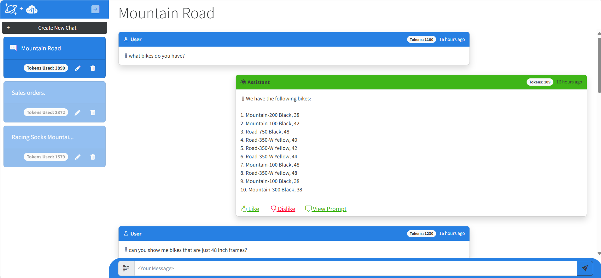
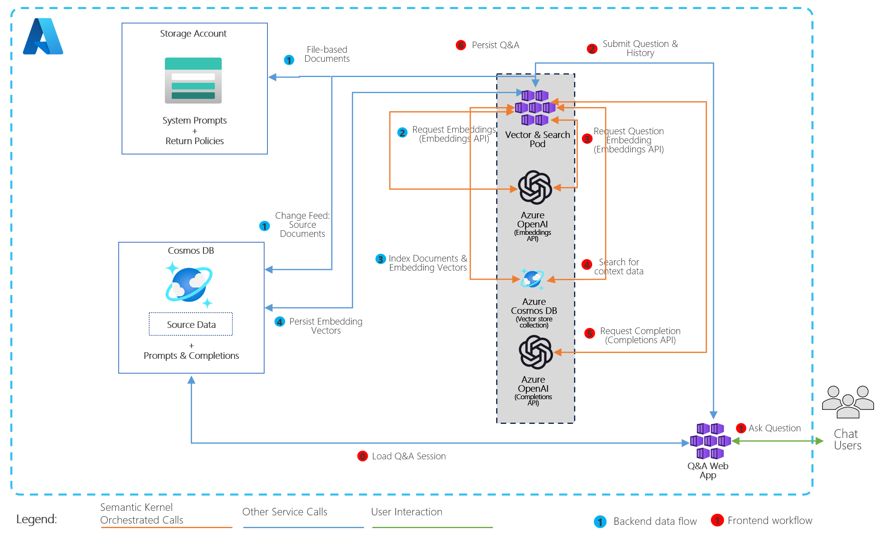
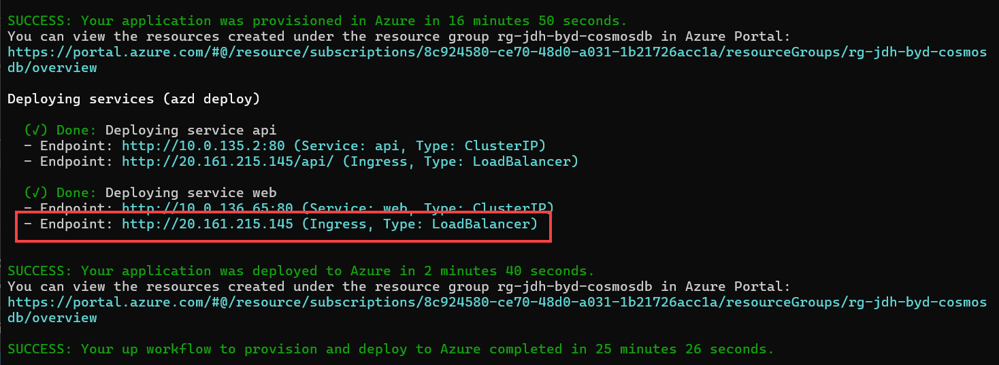
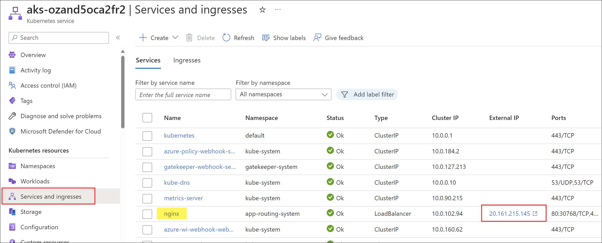
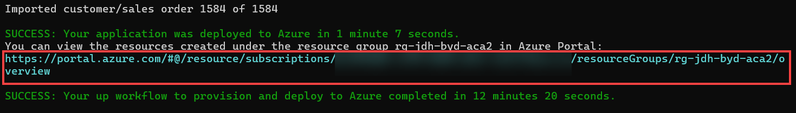
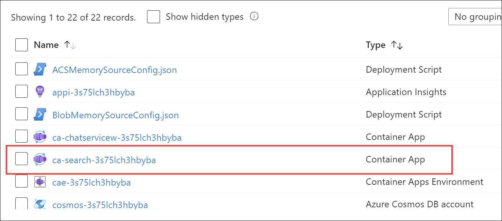
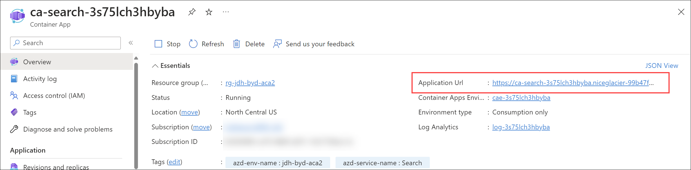

# Build Your Own Copilot with Azure Cosmos DB

This solution demonstrates how to design and implement a RAG Pattern solution that incorporates Azure Cosmos DB with Azure OpenAI Service along with other key Azure services, to build a Generative AI solution with an AI assistant user interface. 

The scenario for this solution is for a consumer retail "Intelligent Agent" for a retail bike shop that sells bicycles, biking accessories, components and clothing. The dataset in this solution is the [Cosmic Works](https://github.com/azurecosmosdb/cosmicworks) sample for Azure Cosmos DB, which is adapted from the [Adventure Works 2017 dataset](https://learn.microsoft.com/en-us/sql/samples/adventureworks-install-configure?view=sql-server-ver16&tabs=ssms).

This solution demonstrates many concepts developers will encounter when building Generative-AI applications including:

- Generating and storing vectors in real-time on transactional data.
- Performing vector searches on data in a database.
- Generating completions from a large language model.
- Managing conversational context and chat history.
- Token management for large langage models.
- Managing data models for defining what data gets vectorized for search.
- How to use Semantic Kernel SDK connectors and plug-ins.


## What is RAG?

RAG is an acronym for Retrieval Augmented Generation, a term that essentially means retrieving additional data to provide as a context to a large language model so it can generate a response (completion) based not just on a user's question (prompt) but also on that context. The data can be any kind of text. However, there is a limit to how much text can be sent due to the limit of [tokens for each model](https://platform.openai.com/docs/models/overview) that can be consumed in a single request/response from OpenAI and other large language models. This solution will highlight this challenge and provide an example of how to address it.

## User Experience

The application frontend acts as an Intelligent Agent. The left-hand navigation contains individual chat sessions. Users type questions, the service queries vectorized data, then sends the question and query results toAzure OpenAI Service to generate a completion which is then displayed to the user. When the user types a second question, the chat session is summarized using a different Azure OpenAI completion and renamed to match the topic for that chat session. The chat session on the left side displays all of the tokens consumed for that session. Each message in the chat also includes a token count consumed in generating it - the `user tokens` are the tokens used in the call to Azure OpenAI Service and the `assistant tokens` are the ones used to generate the completion.

<p align="center">
    
</p>


## Solution Architecture

The solution architecture is represented by this diagram:

<p align="center">
    
</p>

## Getting Started

To deploy the solution follow the Deployment steps below. Once deployed, follow these links to get familiar with and explore the solution.

- [Key Concepts to Understand](/docs/concepts.md)
- [Solution QuickStart](/docs/quickstart.md)
- [Run and Debug Locally](/docs/runlocal.md)
- [Adding new data](/docs/addnewdata.md)

### Deployment

This solution deploys to either Azure Kubernetes Service (**AKS**) or Azure Container Apps (**ACA**). The deployment scripts are located in the `aks` folder. The deployment scripts are designed to be run from the root of the repository. To deploy the solution, run the following commands from the root of the repository:

#### AKS deployment

```bash
cd ./aks
azd up
```

After running `azd up` on the **AKS** deployment and the deployment finishes, you will see the output of the script which will include the URL of the web application. You can click on this URL to open the web application in your browser. The URL is beneath the "Done: Deploying service web" message, and is the second endpoint (the Ingress endpoint of type `LoadBalancer`).



If you closed the window and need to find the external IP address of the service, you can open the Azure portal, navigate to the resource group you deployed the solution to, and open the AKS service. In the AKS service, navigate to the `Services and Ingress` blade, and you will see the external IP address of the LoadBalancer service, named `nginx`:



#### ACA deployment

```bash
cd ./aca
azd up
```

After running `azd up` on the **ACA** deployment and the deployment finishes, you can locate the URL of the web application by navigating to the deployed resource group in the Azure portal. Click on the link to the new resource group in the output of the script to open the Azure portal.



In the resource group, you will see the `ca-search-xxxx` Azure Container Apps service.



Select the service to open it, then select the `Application Url` to open the web application in your browser.



> [!NOTE]
> There are many options for deployment, including using an existing Azure OpenAI account and models. For deployment options and prerequisistes, please see [How to Deploy](./docs/deployment.md) page.

Before moving to the next section, be sure to validate the deployment is successful. More information can be found in the [How to Deploy](./docs/deployment.md) page.

## Clean-up

From a command prompt, navigate to the `aks` or `aca` folder, depending on which deployment type you used, and run the following command to delete the resources created by the deployment script:

### AKS clean-up

```bash
cd ./aks
azd down --purge
```

### ACA clean-up

```bash
cd ./aca
azd down --purge
```

> [!NOTE]
> The `--purge` flag purges the resources that provide soft-delete functionality in Azure, including Azure KeyVault and Azure OpenAI. This flag is required to remove all resources.

## Resources

- [Azure Cosmos DB Vector Database Concepts](https://learn.microsoft.com/azure/cosmos-db/vector-database)
- [Azure Cosmos DB Vector Database Announcements at BUILD 2024 ](https://devblogs.microsoft.com/cosmosdb/introducing-vector-database-capabilities-in-azure-cosmos-db-for-nosql/)
- [Semantic Kernel Overview](https://learn.microsoft.com/semantic-kernel/overview)
