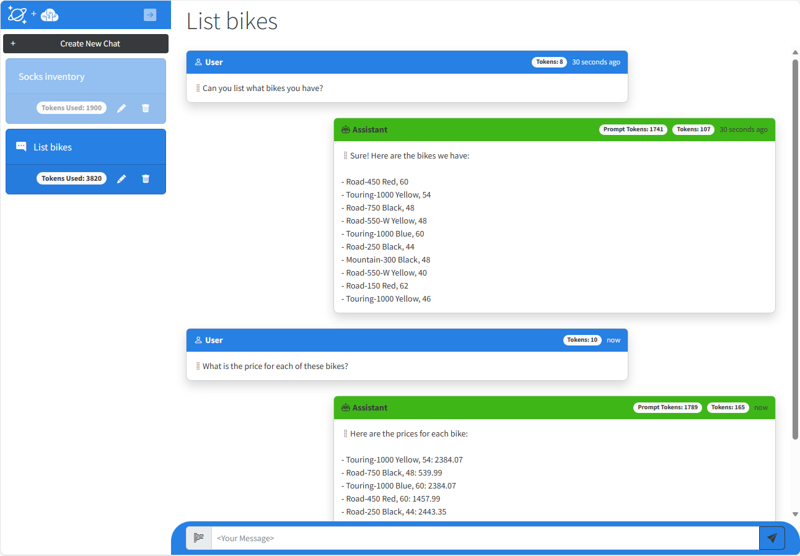
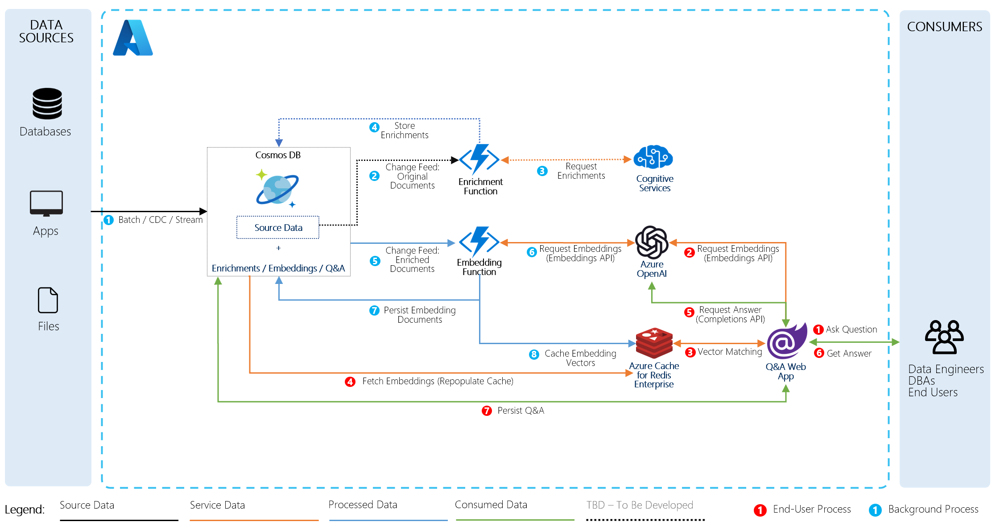
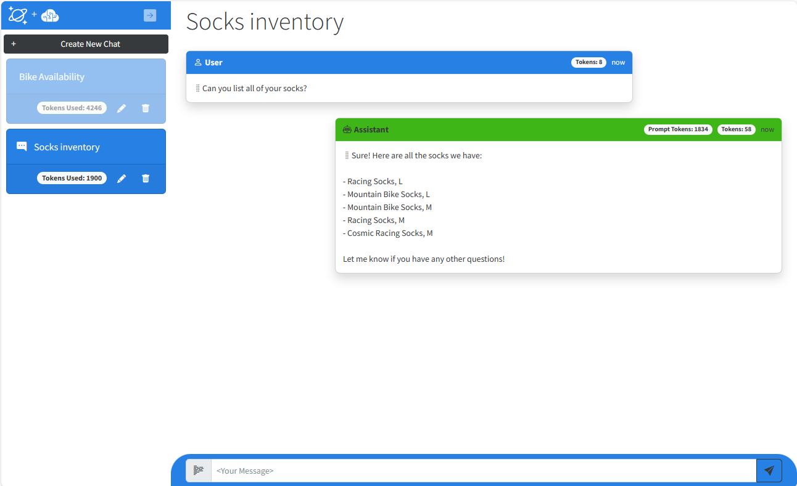

# Vector Search & AI Assistant for Azure Cosmos DB and Azure Cognitive Search (aka Bring Your Data to ChatGPT)

This solution demonstrates how to design and implement a RAG Pattern solution that incorporates Azure Cosmos DB with Azure OpenAI and Azure Cognitive Search to build a vector search solution with an AI assistant user interface. The solution shows how to generate vectors on data stored in Azure Cosmos DB using Azure OpenAI, how to implement vector search using the vector search capability of Azure Cognitive Search and get the reponse from Azure OpenAI's ChatGPT using the matched documents as a context. The solution includes the frontend and backend components hosted on Azure Kubetnetes Service. The solution also showcases key concepts such as managing conversational context and history, managing tokens consumed by Azure OpenAI, as well as understanding how to write prompts for large language models such as ChatGPT so they produce the desired responses.

The scenario for this sample centers around a consumer retail "Intelligent Agent" that allows users to ask questions on vectorized product, customer and sales order data stored in the database. The data in this solution is the [Cosmic Works](https://github.com/azurecosmosdb/cosmicworks) sample for Azure Cosmos DB. This data is an adapted subset of the [Adventure Works 2017 dataset](https://learn.microsoft.com/en-us/sql/samples/adventureworks-install-configure?view=sql-server-ver16&tabs=ssms) for a retail bike shop that sells bicycles, biking accessories, components and clothing.

## What is RAG?

RAG is an aconymn for Retrival Augmentmented Generation, a term that essentially means retrieving additional data to provide as a context to a large language model so it can generate a response (completion) based not just on a user's question (prompt) but also on that context. The data can be any kind of text. However, there is a limit to how much text can be sent due to the limit of [tokens for each model](https://platform.openai.com/docs/models/overview) that can be consumed in a single request/response from Azure OpenAI. This solution will highlight this challenge and provide an example of how to address it.

## Solution User Experience

The application frontend is a Blazor application with Intelligent Agent UI functionality:

The application includes a left-hand navigation that contains individual chat sessions. When a user submits types a question and hits Enter the service queries the vector data, then sends the response to Azure OpenAI which then generates a completion which is then displayed to the user. The first question also triggers the chat session to be named with whatever the user is asking about. User can rename a chat if they like or delete it. The chat session displays all of the tokens consumed for that session, while each message in the chat also includes a token count consumed in generating it - the `User tokens` are the tokens used in the call to Azure OpenAI and the `Assistant tokens` are the ones used to generate the completion.

<p align="center">
    
</p>


## Solution Architecture

The solution architecture is represented by this diagram:

<p align="center">
    
</p>

## Overall solution workflow

There are four key elements of this solution: generating vectors, searching vectors, generating chat completions and storing chat conversations. Vectors are generated when data is inserted into Azure Cosmos DB, then stored in an Azure Cognitive Search index that is used for vector searches. Users then ask natural language questions using the web-based chat user interface (User Prompts). These prompts are then vectorized and used to search the vectorized data. The results are then sent, along with some of the conversation history, to Azure OpenAI to generate a response (Completion) back to the user. All of the User Prompts and Completions are stored in a Cosmos DB container along with the number of tokens consumed by each Prompt and Completion. A Chat Session contains all of the prompts and completions and a running total of all tokens consumed for that session. In a production environment users would only be able to see their own sessions but this solution shows all sessions from all users.

## Generating vectors

Vectors are generated in Change Feed handler (GenericChangeFeedHandler() function) contained in the `VectorSearchAiAssistant.Service` project which monitors the changes in `customer` and `products` containers. As soon as a new document is inserted into either of these containers, the Change Feed handler will generate a vector and add the document and its embedding to the `vector-index` Cognitive Search index.


## Searching vectors

The web-based front-end provides users the means for searching the vectorized retail bike data for this solution. This work is centered around the [AzureCognitiveSearchVectorMemory](https://github.com/AzureCosmosDB/VectorSearchAiAssistant/blob/cognitive-search-vector/VectorSearchAiAssistant.SemanticKernel/Memory/AzureCognitiveSearch/AzureCognitiveSearchVectorMemory.cs) in the `VectorSearchAiAssistant.SemanticKernel` project. In the chat UI, a user starts a new chat session then types in a natural language question. The text is sent to Azure OpenAI embeddings API to generate vectors on it. The vectors are then used to perform a vector search on the vectors collection in Azure Cognitive Search. The query response which includes the original source data is sent to Azure OpenAI to generate a completion which is then passed back to the user as a response.

## Key concepts this solution highlights

Building a solution like this introduces a number of concepts that may be new to many developers looking to build these types of applications. This solution was developed to surface these key concepts and make it easy for users to follow from a single function in the Chat Service called [GetChatCompletionAsync()](https://github.com/AzureCosmosDB/VectorSearchAiAssistant/blob/cognitive-search-vector/VectorSearchAiAssistant.Service/Services/ChatService.cs#L92). Debugging the Azure Web App remotely or running locally will allow you to set a breakpoint at the start of this function and step through each of the subsequent functions called from within it to see these concepts in action as it calls the other services in the solution to complete the request workflow.

### Managing conversational context and history

Large language models such as ChatGPT do not keep any history of what prompts users sent it, or what completions it generated. It is up to the developer to do this. Keeping this history is necessary for two reasons. First, it allows users to ask follow-up questions without having to provide any context, while also allowing the user to have a conversation with the model. Second, the conversation history is useful when performing vector searche on data as it provides additional detail on what the user is looking for. As an example, if I asked our Intelligent Retail Agent what bikes it had available, it would return for me all of the bikes in stock. If I then asked, "what colors are available?", if I did not pass the first prompt and completion, the vector search would not know that the user was asking about bike colors and would likely not produce an accurate or meaningful response.

Another concept surfaced with conversation management centers around tokens. All calls to Azure OpenAI are limited by the number of tokens in a request and response. The number of tokens is dependant on the model being used. You see each model and its token limit on OpenAI's website on their [Models Overview page](https://platform.openai.com/docs/models/overview).

The class that manages conversational history is called, [ChatBuilder()](https://github.com/AzureCosmosDB/VectorSearchAiAssistant/blob/cognitive-search-vector/VectorSearchAiAssistant.SemanticKernel/Chat/ChatBuilder.cs). This class is used to gather the most convesation history up to the token limits defined in configuration, then returns it as a string separating each prompt and completion with a new line character. The new line is not necessary for ChatGPT, but makes it more readable for a user when debugging. This function also returns the number of tokens used in the conversation. This value is used when building the prompt to send.

### Vectorizing the user prompt and conversation history

In a vector search solution, the filter predicate for any query is an array of vectors. This means that the text the user types in to the chat window, plus any conversational context that is gathered, must first be vectorized before the vector search can be done. This is accomplished in the [SemanticKernelRAGService](https://github.com/AzureCosmosDB/VectorSearchAiAssistant/blob/cognitive-search-vector/VectorSearchAiAssistant.Service/Services/SemanticKernelRAGService.cs) in the solution in the [GetResponse()](https://github.com/AzureCosmosDB/VectorSearchAiAssistant/blob/cognitive-search-vector/VectorSearchAiAssistant.Service/Services/SemanticKernelRAGService.cs#L83) function. This function takes a string and returns an array of vectors, along with the number of tokens used by the service.

### Doing the vector search

The vector search is the key function in this solution and is done against the Azure Cognitive Search index in this solution. The function itself is rather simple and only takes and array of vectors with which to do the search. You can see the vector search at work by debugging the Azure Web App remotely or running locally. Set a break point on [SearchAsync()](https://github.com/AzureCosmosDB/VectorSearchAiAssistant/blob/cognitive-search-vector/VectorSearchAiAssistant.SemanticKernel/Memory/AzureCognitiveSearch/AzureCognitiveSearchVectorMemory.cs#L258), then step through each line to see how of the function calls to see the search and returned data.

### Token management

One of the more challenging aspects to building RAG Pattern solutions is manging the tokens to stay within the maximum number of tokens that can be consumed in a single request (prompt) and response (completion). It's possible to build a prompt that consumes all of the tokens in the requests and leaves too few to produce a useful response. It's also possible to generate an exception from the Azure OpenAI service if the request itself is over the token limit. You will need a way to measure token usage before sending the request. This is handled in the [OptimizePromptSize()](https://github.com/AzureCosmosDB/VectorSearchAiAssistant/blob/cognitive-search-vector/VectorSearchAiAssistant.SemanticKernel/Chat/ChatBuilder.cs#L103) function in the ChatBuilder class. This function uses the SemanticKernel tokenizer, [GPT3Tokenizer](https://github.com/AzureCosmosDB/VectorSearchAiAssistant/blob/cognitive-search-vector/VectorSearchAiAssistant.SemanticKernel/Chat/SemanticKernelTokenizer.cs). The utility takes text and generates an array of vectors. The number of elements in the array represent the number of tokens that will be consumed. It can also do the reverse and take an array of vectors and output text. In our function here we first generate the vectors on the data returned from our vector search, then if necessary, reduce the amount of data by calculating the number of vectors we can safely pass in our request to Azure OpenAI. Here is the flow of this function.

1. Measure the amount of tokens for the vector search results (rag data).
2. Measure the amount of tokens for the user prompt. This data is also used to capture what the user prompt tokens would be if processed without any additional data and stored in the user prompt message in the completions collection (more on that later).
3. Calculate if the amount of tokens used by the `search results` plus the `user prompt` plus the `conversation` + `completion` is greater than what the model will accept. If it is greater, then calculate how much to reduce the amount of data and `Decode` the vector array we generated from the search results, back into text.
4. Finally, return the text from our search results as well as the number of tokens for the last User Prompt (this will get stored a bit later).

### Generate the completion

We're finally at the most critical part of this entire solution, generating a chat completion from Azure OpenAI using one of its [GPT models](https://platform.openai.com/docs/guides/gpt) wherein the Azure OpenAI service will take in all of the data we've gathered up to this point, then generate a response or completion which the user will see. All of this happens in the [SemanticKernelRAGService](https://github.com/AzureCosmosDB/VectorSearchAiAssistant/blob/cognitive-search-vector/VectorSearchAiAssistant.Service/Services/SemanticKernelRAGService.cs) in the [GetResponse()](https://github.com/AzureCosmosDB/VectorSearchAiAssistant/blob/cognitive-search-vector/VectorSearchAiAssistant.Service/Services/SemanticKernelRAGService.cs#L83) function. 

This function takes the user prompt and the search results and builds a `System Prompt` with the search data, as well as a user prompt that includes the conversation history plus the users last question (prompt). The call is then made to the service which returns a `ChatCompletions` object which contains the response text itself, plus the number of tokens used in the request (prompt) and the number of tokens used to generate the response (completion). 

One thing to note here is it is necessary to separate the number of tokens from the Prompt with the data versus the number of tokens from the text the user typed into the chat interface. This is necessary because we need an accurate way to estimate the number of tokens for *just the text* of the user prompt and not from the data.

### Saving the results

The last part is to save the results of both our user prompt and completion as well as the amount of tokens used. All of the conversational history and the amount of tokens used in each prompt and completion is stored in the completions collection in the Azure Cosmos DB database in this solution. The call to the service is made by another function within our ChatService called, [AddPromptCompletionMessagesAsync()](https://github.com/AzureCosmosDB/VectorSearchAiAssistant/blob/cognitive-search-vector/VectorSearchAiAssistant.Service/Services/ChatService.cs#L129). This function creates two new [Message](https://github.com/AzureCosmosDB/VectorSearchAiAssistant/blob/cognitive-search-vector/VectorSearchAiAssistant.Service/Models/Chat/Message.cs) objects and stores them in a local cache of all the Sessions and Messages for the application. It then adds up all of the tokens used and saves it to the Session object which keeps a running total for the entire [Session](https://github.com/AzureCosmosDB/VectorSearchAiAssistant/blob/cognitive-search-vector/VectorSearchAiAssistant.Service/Models/Chat/Session.cs).

The data is then saved in the [UpdateSessionBatchAsync()](https://github.com/AzureCosmosDB/VectorSearchAiAssistant/blob/cognitive-search-vector/VectorSearchAiAssistant.Service/Services/CosmosDbService.cs#L307) function in the Cosmos DB database. This function creates a new transaction then updates the Session document and inserts two new Message documents into the completions collection.


## Getting Started

### Deployment

Check the [Deployment](./docs/deployment.md) page for instructions on how to deploy the solution to your Azure subscription.
Once your deployment is complete, you can proceed to the [Quickstart](#quickstart) section.

### Quickstart

1. Navigate to resource group and obtain the name of the AKS service and execute the following command to obtain the OpenAI Chat endpoint

  ```pwsh
  az aks show -n <aks-name> -g <resource-group-name> -o tsv --query addonProfiles.httpApplicationRouting.config.HTTPApplicationRoutingZoneName
  ```
  > Note: The same hostname should also be output upon successful completion of the deployment script invocation.

1. Browse to the web app with the returned hostname.
1. Click [+ Create New Chat] button to create a new chat session.
1. Type in your questions in the text box and press Enter.

Here are some sample questions you can ask:

- What kind of socks do you have available?
- Do you have any customers from Canada? Where in Canada are they from?
- What kinds of bikes are in your product inventory?

### Real-time add and remove data

One great reason about using an operational database like Azure Cosmos DB as your source for data to be vectorized and search is that you can leverage its
Change Feed capability to dynamically add and remove products to the vector data which is searched. The steps below can demonstrate this capability.

#### Steps to demo adding and removing data from vector search

1. Start a new Chat Session in the web application.
1. In the chat text box, type: "Can you list all of your socks?". The AI Assistant will list 4 different socks of 2 types, racing and mountain.
1. Using either CURL or Postman, send the following payload in a PUT request with a `Content-Type` header value of `application/json` to `https://<chat-service-hostname>/api/products` to add a product.
  
    ##### Curl Command
    ```pwsh
    curl -X PUT -H "Content-Type: application/json" -d $JsonPayload https://<chat-service-hostname>/api/products
    ```

    ##### Json Payload
    ```json
    {
        "id": "00001",
        "categoryId": "C48B4EF4-D352-4CD2-BCB8-CE89B7DFA642",
        "categoryName": "Clothing, Socks",
        "sku": "SO-R999-M",
        "name": "Cosmic Racing Socks, M",
        "description": "The product called Cosmic Racing Socks, M",
        "price": 6.00,
        "tags": [
            {
                "id": "51CD93BF-098C-4C25-9829-4AD42046D038",
                "name": "Tag-25"
            },
            {
                "id": "5D24B427-1402-49DE-B79B-5A7013579FBC",
                "name": "Tag-76"
            },
            {
                "id": "D4EC9C09-75F3-4ADD-A6EB-ACDD12C648FA",
                "name": "Tag-153"
            }
        ]
    }
    ```
    > Note the `id` of `00001` and `categoryId` of `C48B4EF4-D352-4CD2-BCB8-CE89B7DFA642`.  We will need these values in a later step.


1. Return to the AI Assistant and type, ""Can you list all of your socks again?". This time you should see a new product, "Cosmic Socks, M"
1. Using either CURL or Postman, send the following payload in a DELETE request to `https://<chat-service-hostname>/api/products/<product_id>?categoryId=<category_id>` to add a product, where `<product_id>` is the value of the `id` field and `<category_id>` is the value of the `categoryId` field of the JSON payload sent via a PUT request in a previous step (`00001` and `C48B4EF4-D352-4CD2-BCB8-CE89B7DFA642`, respectively, in this case).

    ##### Curl Command
    ```pwsh
    curl -X DELETE https://<chat-service-hostname>/api/products/<product_id>?categoryId=<category_id>
    ```

1. Open a **new** chat session and ask the same question again. This time it should show the original list of socks in the product catalog. 

**Note:** Using the same chat session after adding them will sometimes result in the Cosmic Socks not being returned. If that happens, start a new chat session and ask the same question. Also, sometimes after removing the socks they will continue to be returned by the AI Assistant. If that occurs, also start a new chat session. The reason this occurs is that previous prompts and completions are sent to OpenAI to allow it to maintain conversational context. Because of this, it will sometimes use previous completions as data to make future ones.

<p align="center">
    
</p>

## Run locally and debug

This solution can be run locally post deployment. Below are the steps.

### Local steps
Use the steps that follow to run the solution on your local machine.
#### Configure local settings

- In the `Search` project, make sure the content of the `appsettings.json` file is similar to this:

    ```json
    {
        "DetailedErrors": true,
        "Logging": {
            "LogLevel": {
            "Default": "Information",
            "Microsoft.AspNetCore": "Warning"
        }
        },
        "AllowedHosts": "*",
        "MSCosmosDBOpenAI": {
            "ChatManager": {
                "APIUrl": "https://localhost:63279",
                "APIRoutePrefix": ""
            }
        }
    }
    ```

- In the `ChatServiceWebApi` project, make sure the content of the `appsettings.json` file is similar to this:

    ```json
    {
        "Logging": {
            "LogLevel": {
                "Default": "Information",
                "Microsoft.AspNetCore": "Warning"
            }
        },
        "AllowedHosts": "*",
        "MSCosmosDBOpenAI": {
            "CognitiveSearch": {
                "IndexName": "vector-index",
                "MaxVectorSearchResults": 10
            },
            "OpenAI": {
                "CompletionsDeployment": "completions",
                "CompletionsDeploymentMaxTokens": 4096,
                "EmbeddingsDeployment": "embeddings",
                "EmbeddingsDeploymentMaxTokens": 8191,
                "ChatCompletionPromptName": "RetailAssistant.Default",
                "ShortSummaryPromptName": "Summarizer.TwoWords",
                "PromptOptimization": {
                    "CompletionsMinTokens": 50,
                    "CompletionsMaxTokens": 300,
                    "SystemMaxTokens": 1500,
                    "MemoryMinTokens": 500,
                    "MemoryMaxTokens": 2500,
                    "MessagesMinTokens": 1000,
                    "MessagesMaxTokens": 3000
                }
            },
            "CosmosDB": {
                "Containers": "completions, customer, product",
                "Database": "database",
                "ChangeFeedLeaseContainer": "leases"
            },
            "DurableSystemPrompt": {
                "BlobStorageContainer": "system-prompt"
            }
        }
    }
    ```

- In the `ChatServiceWebApi` project, create an `appsettings.Development.json` file with the following content (replace all `<...>` placeholders with the values from your deployment):

    ```json
    {
        "MSCosmosDBOpenAI": {
            "CognitiveSearch": {
                "Endpoint": "https://<...>.search.windows.net",
                "Key": "<...>"
            },
            "OpenAI": {
                "Endpoint": "https://<...>.openai.azure.com/",
                "Key": "<...>"
            },
            "CosmosDB": {
                "Endpoint": "https://<...>.documents.azure.com:443/",
                "Key": "<...>"
            },
            "DurableSystemPrompt": {
                "BlobStorageConnection": "<...>"
            }
        }
    }
    ```

    >**NOTE**: THe `BlobStorageConnection` value can be found in the Azure Portal by navigating to the Storage Account created by the deployment (the one that has a container named `system-prompt`) and selecting the `Access keys` blade. The value is the `Connection string` for the `key1` key.

#### Using Visual Studio

To run locally and debug using Visual Studio, open the solution file to load the projects and prepare for debugging.

Before you can start debugging, you need to set the startup projects. To do this, right-click on the solution in the Solution Explorer and select `Set Startup Projects...`. In the dialog that opens, select `Multiple startup projects` and set the `Action` for the `ChatServiceWebApi` and `Search` projects to `Start`.

Also, make sure the newly created `appsettings.Development.json` file is copied to the output directory. To do this, right-click on the file in the Solution Explorer and select `Properties`. In the properties window, set the `Copy to Output Directory` property to `Copy always`..

You are now ready to start debugging the solution locally. To do this, press `F5` or select `Debug > Start Debugging` from the menu.

**NOTE**: With Visual Studio, you can also use alternate ways to manage the secrets and configuration. For example, you can use the `Manage User Secrets` option from the context menu of the `ChatWebServiceApi` project to open the `secrets.json` file and add the configuration values there.

### Uploading New Sample Data

To upload new data, or to extend the solution to ingest your own data, that will be processed by the change feed and then made available as context data for chat completions we recommend you use the [Cosmos DB Desktop Migration Tool](https://github.com/AzureCosmosDB/data-migration-desktop-tool) to copy your source data into the appropriate container within the deployed instance of Cosmos DB. 

Open a PowerShell and run the following lines to download and extract `dmt.exe`:
```ps
$dmtUrl="https://github.com/AzureCosmosDB/data-migration-desktop-tool/releases/download/2.1.1/dmt-2.1.1-win-x64.zip"
Invoke-WebRequest -Uri $dmtUrl -OutFile dmt.zip
Expand-Archive -Path dmt.zip -DestinationPath .
```

In the folder containing the extracted files, you will see a `migrationsettings.json` file. You will need to edit this file and provide the configuration for the source (e.g., your local files), and the sink (e.g., a container in Cosmos DB).

Here is an example migrationsettings file setup to load a local JSON file, stored in a data folder, to a container in Cosmos DB. Edit this file to suit your needs and save it.

```json
{
  "Source": "JSON",
  "Sink": "Cosmos-nosql",
  "Operations": [
    {
      "SourceSettings": {
        "FilePath": "data\\sampleData.json"
      },
      "SinkSettings": {
        "ConnectionString": "AccountEndpoint=YOUR_CONNECTION_STRING_HERE",
        "Database":"database",
        "Container":"raw",
        "PartitionKeyPath":"/id",
        "RecreateContainer": false,
        "BatchSize": 100,
        "ConnectionMode": "Direct",
        "MaxRetryCount": 5,
        "InitialRetryDurationMs": 200,
        "CreatedContainerMaxThroughput": 1000,
        "UseAutoscaleForCreatedContainer": true,
        "WriteMode": "InsertStream",
        "IsServerlessAccount": false
        }
    }
  ]
}
```

Then run the tool with the following command.

```ps
.\dmt.exe
```

If no errors appear, your new data should now be available in the configured container.

NOTE: If you want to build a reusable, automated script to deploy your files, take a look at the `scripts/Import-Data.ps1` in the source code of this project.

## Clean-up

Delete the resource group to delete all deployed resources.

## Resources

- [Upcoming blog post announcement](https://devblogs.microsoft.com/cosmosdb/)
- [Azure Cosmos DB Free Trial](https://aka.ms/TryCosmos)
- [OpenAI Platform documentation](https://platform.openai.com/docs/introduction/overview)
- [Azure OpenAI Service documentation](https://learn.microsoft.com/azure/cognitive-services/openai/)
