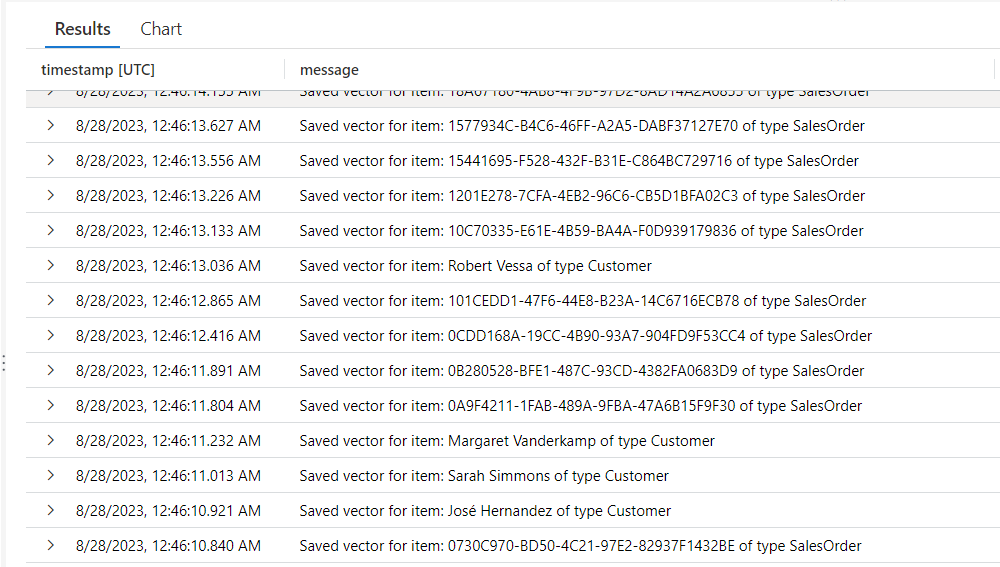

# Deployment

Users can deploy this solution from three locations, local machine, virtual machine, or from Cloud Shell. See [Deployment choices](#deployment-choices) for more information on why you would use those two installation options instructions. By default this should install from your local machine so you can have the code locally to run and debug.

## Prerequisites

- Azure Subscription
- Subscription access to Azure OpenAI service. Start here to [Request Access to Azure OpenAI Service](https://customervoice.microsoft.com/Pages/ResponsePage.aspx?id=v4j5cvGGr0GRqy180BHbR7en2Ais5pxKtso_Pz4b1_xUOFA5Qk1UWDRBMjg0WFhPMkIzTzhKQ1dWNyQlQCN0PWcu)
- .NET 7 SDK
- Docker Desktop
- Azure CLI ([v2.51.0 or greater](https://docs.microsoft.com/cli/azure/install-azure-cli))
- [Helm 3.11.1 or greater](https://helm.sh/docs/intro/install/) (for AKS deployment)
- Visual Studio 2022 (only needed if you plan to run/debug the solution locally)

>**NOTE**: Installation requires the choice of an Azure Region. Make sure to set region you select which is used in the `<location>` value below supports Azure OpenAI services.  See [Azure OpenAI service regions](https://azure.microsoft.com/explore/global-infrastructure/products-by-region/?products=cognitive-services&regions=all) for more information.

## Deployment steps

Follow the steps below to deploy the solution to your Azure subscription.

1. Ensure all the prerequisites are installed.  

2. Clone the repository:
   
    ```cmd
    git clone https://github.com/Azure/Vector-Search-AI-Assistant.git
    ```

3. Switch to the `cognitive-search-vector` branch:

    ```cmd
    cd Vector-Search-AI-Assistant
    git checkout cognitive-search-vector
    ```

4. Run the following script to provision the infrastructure and deploy the API and frontend. This will provision all of the required infrastructure, deploy the API and web app services into your choice of Azure Kubeternetes Service or Azure Container Apps, and import data into Azure Cosmos DB.

    ### Deploy with Azure Kubernetes Service
    This script will deploy all services including a new Azure OpenAI account and AKS

    ```pwsh
    ./scripts/Unified-Deploy.ps1 -resourceGroup <rg_name> -location <location> -subscription <target_subscription_id> -deployAks 1
    ```

    ### Deploy with pre-existing Azure OpenAI service with Azure Kubernetes Service
    This script will deploy using a pre-existing Azure OpenAI account and pre-deployed GPT 3.5 Turbo and ADA-002 models and AKS

    ```pwsh
    ./scripts/Unified-Deploy.ps1 -resourceGroup <rg_name> -location <location> `
        -subscription <target_subscription_id> -deployAks 1 `
        -openAiName <openai-account> `
        -openAiRg <openai-rg-name> `
        -openAiCompletionsDeployment <gpt-model-name> `
        -openAiEmbeddingsDeployment <ada-002-model-name>
    ```

    To validate the deployment using AKS run the following script. When the script it complete it will also output this value. You can simply click on it to launch the app. 

    > ```pwsh
    >  az aks show -n <aks-name> -g <resource-group-name> -o tsv --query addonProfiles.httpApplicationRouting.config.HTTPApplicationRoutingZoneName
    >  ```	 


    ### Deploy with Azure Container Apps
    This script will deploy all services including a new Azure OpenAI account using Azure Container Apps. (This can be a good option for users not familiar with AKS)

    ```pwsh
    ./scripts/Unified-Deploy.ps1 -resourceGroup <rg_name> -location <location> -subscription <target_subscription_id> -deployAks 0
    ```

    ### Deploy with pre-existing Azure OpenAI service with Azure Container Apps
    This script will deploy using a pre-existing Azure OpenAI account and pre-deployed GPT 3.5 Turbo and ADA-002 models and AKS

    ```pwsh
    ./scripts/Unified-Deploy.ps1 -resourceGroup <rg_name> -location <location> `
        -subscription <target_subscription_id> -deployAks 0 `
        -openAiName <openai-account> `
        -openAiRg <openai-rg-name> `
        -openAiCompletionsDeployment <gpt-model-name> `
        -openAiEmbeddingsDeployment <ada-002-model-name>
    ```

    To validate the deployment to ACA run the following script. 
    > ```pwsh
    >  az containerapp show -n <aca-name> -g <resource-group-name>
    >  ```


## Deployment choices

The following table summarizes the deployment choices available for the solution:

 Deployment type | Description | When to use
--- | --- | ---
[Standard](./deployment-standard.md) | Use your local development environment to deploy the solution to your Azure subscription. | Best suited for situations where you need the flexibility of a full development environment (e.g. to customize the solution) and you have a local development environment available.
[Cloud Shell](./deployment-cloudshell.md) | Use Azure Cloud Shell to deploy the solution to your Azure subscription. | Best suited for quick deployment. All you need is an Azure subscription and a browser. However, this does require additional setup steps. For more information see, [Prepare Cloud Shell Setup](./deployment-cloudshell-setup.md)
[Azure VM](./deployment-azurevm.md) | Use an Azure VM to deploy the solution to your Azure subscription. | Best suited for situations where you need the flexibility of a full development environment (e.g. to customize the solution) but you don't have a local development environment available. The Azure VM deployment type requires additional setup steps. If you are involved in managing the infrastructure that enables Azure VM deployments for your team, see [Prepare Azure VM Setup](./deployment-azurevm-setup.md) for more information.


## Deployment validation

Use the steps below to validate that the solution was deployed successfully.

Once the deployment script completes, the Application Insights `traces` query should display the following sequence of events:


Next, you should be able to see multiple entries referring to the vectorization of the data that was imported into Cosmos DB:



Finally, you should be able to see the Cognitive Search index being populated with the vectorized data:


>**NOTE**:
>
>It takes several minutes until all imported data is vectorized and indexed.

## Monitoring with Application Insights

Use the steps below to monitor the solution with Application Insights:

1. Navigate to the `Application Insights` resource that was created as part of the deployment.

2. Select the `Logs` section and create a new query with the following statement. Change the "Time range" setting on top tool bar to reflect the required time range. Click the `Run` button to execute the query:

    ```kql
    traces
    | order by timestamp desc
    ```

    

3. Select the `Export` button to explort the results the query.

4. In the query, replace `traces` with `requests` or `exceptions` to view the corresponding telemetry.
